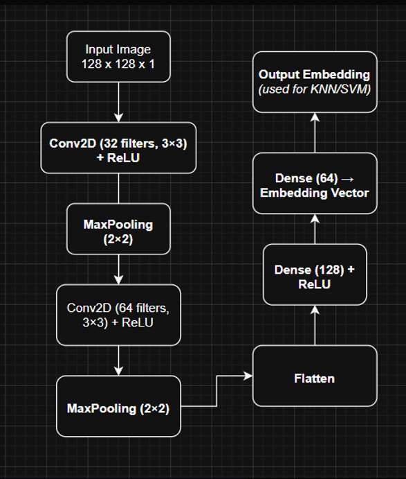
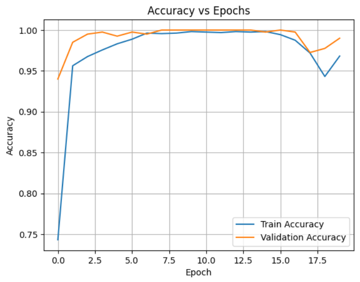
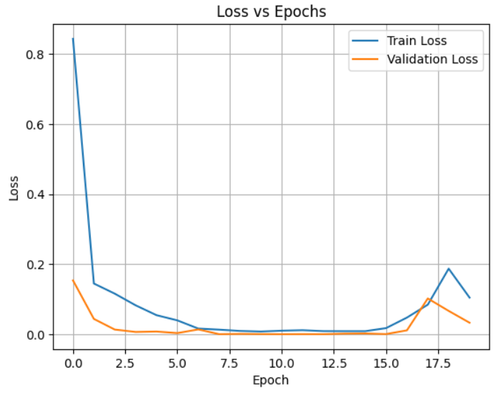
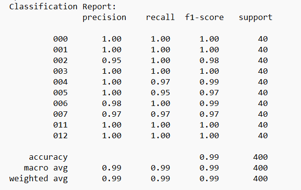
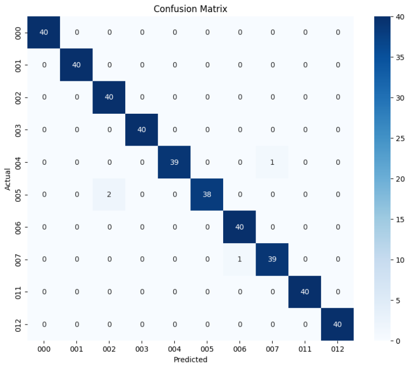
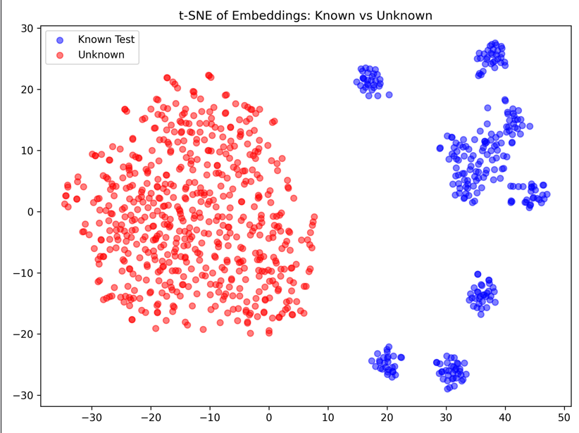

# 3D Ear Recognition using Deep Learning

An open-set biometric recognition system capable of identifying known individuals while reliably rejecting unseen identities using deep metric learning.

The project progressively evolved from a custom CNN to EfficientNet-B0 and finally to a Triplet Network with ensemble-based unknown detection.

---

## Features

- Open-set biometric recognition
- EfficientNet-B0 feature extraction
- Triplet Loss metric learning
- 512-dimensional embedding generation
- KNN, SVM and Logistic classifiers
- One-Class SVM based anomaly detection
- Isolation Forest anomaly detection
- Ensemble voting for unknown detection
- 96–97% known class accuracy
- 94.33% unknown detection rate

## Dataset

- 2,600 ear images
- 13 identity groups
- Training Images: 1480
- Validation Images: 520
- Testing Images: 600

Unknown identities were completely excluded from training and used only during testing to evaluate open-set recognition.

## Project Pipeline

  

## Model Evolution

### Initial Model – EmbeddingNet

- Custom CNN architecture
- Softmax Loss
- KNN/SVM classifier
- Known Accuracy: 88–92%
- Unknown Detection: ~30%

---

### EfficientNet-B0

- Better feature extraction
- Improved generalization
- Known Accuracy: 90–94%
- Unknown Detection: ~45%

---

### Final Model – TripletNet

- EfficientNet-B0 Backbone
- Triplet Loss
- 512-D embeddings
- KNN, SVM, Logistic Regression

## Training Curves

  

Training converged rapidly with testing accuracy stabilizing around **96–97%** while maintaining a very low loss value.

## Classification Report

  

## Confusion Matrix

The confusion matrix demonstrates excellent classification performance with only a few isolated misclassifications.

## Learned Feature Space

The learned embeddings form compact clusters for known identities while unknown identities remain well separated, validating the effectiveness of metric learning.

## Unknown Detection Strategies

### Softmax Threshold

- Threshold = 0.70
- Detection = 18%

### Confidence Threshold

- Threshold = 0.83
- Detection = 60%

### Distance Threshold

- Euclidean Distance = 0.50

### One-Class SVM

- Detection = 89%

### Isolation Forest

- Detection = 55%

### Final Ensemble

- Majority Voting
- Unknown Detection = **94.33%**

## Performance Comparison

| Model | Backbone | Known Accuracy | Unknown Detection |
|--------|-----------|---------------|-------------------|
| EmbeddingNet | Custom CNN | 88–92% | 30% |
| EfficientNet | EfficientNet-B0 | 90–94% | 45% |
| TripletNet | EfficientNet-B0 | **96–97%** | **94.33%** |

## Tech Stack

### Deep Learning
- PyTorch
- Torchvision
- Albumentations

### Machine Learning
- Scikit-Learn
- KNN
- SVM
- Logistic Regression
- One-Class SVM
- Isolation Forest

### Visualization
- Matplotlib
- Seaborn
- t-SNE

## Results

✔ Known Class Accuracy: **96–97%**

✔ Unknown Detection Rate: **94.33%**

✔ Robust Open-Set Recognition

✔ High Feature Discrimination

✔ Strong Generalization to Unseen Identities

## Future Work

- ArcFace-based metric learning
- Vision Transformer backbone
- Real-time inference optimization
- Deployment using ONNX/TensorRT
- Larger biometric datasets
